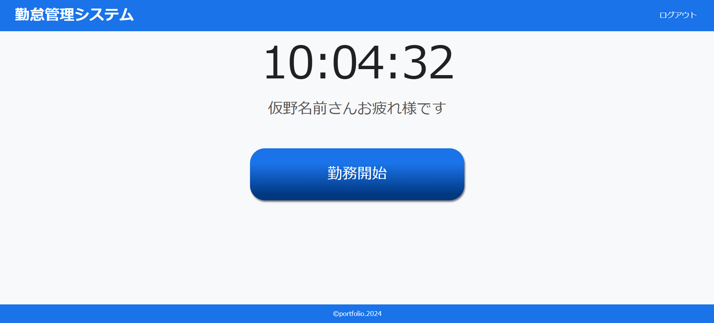
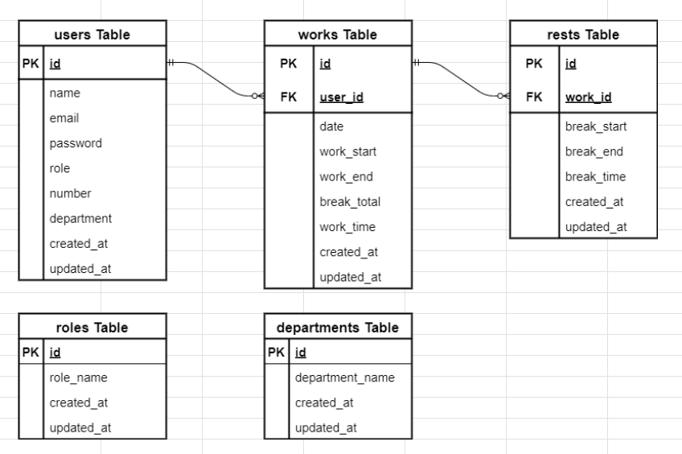

# 勤怠管理システム～Attendance management system～



**こちらは勤怠管理システムのバックエンドになります。**

:::note info
ご利用にはフロントエンドとバックエンド両方を起動していただく必要があります。
:::

下記の環境構築手順でバックエンドの環境構築後、dockerのコンテナが起動している状態でフロントエンドを起動してください。

フロントエンドはこちらのURLになります。

## フロントエンド リポジトリ URL

https://github.com/basstuba/ams-frontend

## 機能一覧

-アカウント作成機能

-ログイン及びログアウト機能

-打刻機能

（出勤、退勤、休憩開始、休憩終了）

-日付別勤怠一覧表示機能

-個人別勤怠一覧表示機能

-ユーザーアカウント検索機能

-ページネーション機能

-エクスポート機能

（日付別勤怠一覧及び個人別勤怠一覧をExcelにて出力）

-打刻修正機能

-打刻追加機能

## 使用技術

フロントエンドの使用技術はフロントエンドのREADMEに記載しています。

| 言語・フレームワーク・その他使用技術 | バージョン |
| ------------------ | ----------|
| Laravel            | 11.9      |
| php                | 8.2.19    |
| nginx              | 1.27.0    |
| mysql              | 8.0.37    |
| phpMyAdmin         |           |
| docker             | 27.4.0    |

## テーブル設計


## ER図



## 環境構築

:::note warn
事前にdockerとGit及びGitHubのインストールをお願い致します。
:::

### Dockerコンテナの構築

1. 任意のディレクトリにて`git clone git@github.com:basstuba/ams.git`を実行

2. `cd ams`にてアプリケーションのディレクトリへ移動

3. DockerDesktopアプリを立ち上げる

4. `docker compose up -d --build`

### Laravelの構築

1. Laravelのインストール
-`docker compose exec php bash`を実行しPHPコンテナにログインして

-`composer install`

2. .envファイルの作成

-PHPコンテナにログインした状態で`cp .env.example .env`

-作成した.envファイルの該当欄を下記のように変更

```
APP_NAME=AMS

APP_TIMEZONE=Asia/Tokyo

APP_LOCALE=ja

APP_FALLBACK_LOCALE=ja

APP_FAKER_LOCALE=ja_JP

DB_CONNECTION=mysql

DB_HOST=mysql

DB_PORT=3306

DB_DATABASE=ams_db

DB_USERNAME=ams_user

DB_PASSWORD=ams_pass
```

3. テーブルの作成

-`docker compose exec php bash`を実行してPHPコンテナにログインする(ログインしたままであれば上記コマンドは実行しなくて良いです。)

-`php artisan migrate`

4. ダミーデータ作成（管理者用アカウントになります。アカウントの詳細はフロントエンドのREADMEに記載しています。）

-PHPコンテナにログインした状態で

-`php artisan db:seed`

5. アプリケーション起動キーの作成

-PHPコンテナにログインした状態で

-`php artisan key:generate`

6. jwtシークレットキーの作成

-PHPコンテナにログインした状態で

-`php artisan jwt:secret`

## その他

1. データベースのテーブルを確認出来るphpMyAdminのURLは下記の通りです。

http://localhost:8080

2. docker-compose.ymlの設定はlocalhostでの接続設定になっています。

3. 環境構築はフロントエンド、バックエンド共にlocalhostでの使用方法となります。