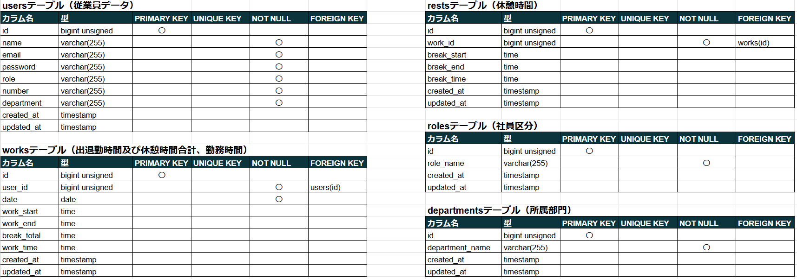

# 勤怠管理システム～Attendance management system～


## プロジェクト概要

このアプリは、従業員の日々の勤怠管理を効率化し、正確な記録と管理者による柔軟な運用を可能にすることを目的としています。

## 特徴

- **APIの柔軟性:** RESTful API設計でフロントエンドとシームレスに連携。

- **データベース管理:** 高速かつ正確な勤怠データ管理。

- **モダンな技術スタック:** Laravelを採用し、安定性と拡張性を確保。

- **管理者専用機能を支えるAPI:** アカウント作成や勤怠データ管理機能に必要なAPIエンドポイントを提供。

> [!Note]
> **こちらは勤怠管理システムのバックエンドになります。**
>
> **ご利用にはフロントエンドとバックエンド両方を起動していただく必要があります。**
>
> 下記の環境構築手順でバックエンドの環境構築後、dockerのコンテナが起動している状態でフロントエンドを起動してください。
>
> 下記のURLよりフロントエンドの環境構築を行ってください。

## フロントエンド リポジトリ URL

https://github.com/basstuba/ams-frontend

## 機能一覧

### ユーザーが利用可能な機能

- ログイン及びログアウト機能

- 打刻機能

   （出勤、退勤、休憩開始、休憩終了）

### 管理者が利用可能な機能

- ユーザーアカウント作成機能

- ユーザーアカウント情報変更機能

- インポート機能

   （ユーザーデータを一括登録）

- 日付別勤怠一覧表示機能

- 個人別勤怠一覧表示機能

- ユーザーアカウント一覧表示機能

- ユーザーアカウント検索機能

- 勤怠データ検索機能

- ページネーション機能

- エクスポート機能

   （日付別勤怠一覧及び個人別勤怠一覧をExcelにて出力）

- 打刻修正機能

- 打刻追加機能

## 使用技術

フロントエンドの使用技術はフロントエンドのREADMEに記載しています。

| 言語・フレームワーク・その他使用技術 | バージョン |
| ------------------ | ----------|
| Laravel            | 11.9      |
| php                | 8.2.19    |
| nginx              | 1.27.0    |
| mysql              | 8.0.37    |
| phpMyAdmin         |           |
| Docker             | 27.4.0    |

## テーブル設計



## ER図


## 環境構築

> [!Warning]
> **事前にDockerとGit及びGitHubのインストールをお願い致します。**

### Dockerコンテナの構築

1. GitHubからアプリケーションを取得

   任意のディレクトリにて
   ```
   git clone git@github.com:basstuba/ams.git
   ```
   を実行後

   ```
   cd ams
   ```
   にてアプリケーションのディレクトリへ移動。

3. DockerDesktopアプリを立ち上げる

4. コンテナをビルド

   アプリケーションのディレクトリにて
   ```
   docker compose up -d --build
   ```
   を実行。

### Laravelの構築

> [!Note]
> **Laravelの構築はアプリケーションのディレクトリにて実行してください。**

1. Laravelのインストール
   ```
   docker compose exec php bash
   ```
   を実行しPHPコンテナにログインして
   ```
   composer install
   ```
   を実行。

2. .envファイルの作成

   PHPコンテナにログインした状態で
   ```
   cp .env.example .env
   ```
   を実行して作成した.envファイルの該当欄を下記のように変更。
   ```
   APP_NAME=AMS

   APP_TIMEZONE=Asia/Tokyo

   APP_LOCALE=ja

   APP_FALLBACK_LOCALE=ja

   APP_FAKER_LOCALE=ja_JP

   DB_CONNECTION=mysql

   DB_HOST=mysql

   DB_PORT=3306

   DB_DATABASE=ams_db

   DB_USERNAME=ams_user

   DB_PASSWORD=ams_pass
   ```

3. テーブルの作成
   ```
   docker compose exec php bash
   ```
   を実行してPHPコンテナにログインして(ログインしたままであれば上記コマンドは実行しなくて良いです。)
   ```
   php artisan migrate
   ```
   を実行。

4. ダミーデータ作成

   PHPコンテナにログインした状態で
   ```
   php artisan db:seed
   ```
   を実行。

> [!Note]
> ダミーデータは以下の内容になります。
> - 管理者用アカウント(アカウントの詳細はフロントエンドのREADMEに記載しています。)
> - テスト用ユーザーアカウント(アカウントの詳細はフロントエンドのREADMEに記載しています。)
> - ユーザーデータ　50件
> - 2024年12月1日から12月31日までの勤務データ　500件
> - 2024年12月1日から12月31日までの勤務データに対する休憩データ　500件

5. アプリケーション起動キーの作成

   PHPコンテナにログインした状態で
   ```
   php artisan key:generate
   ```
   を実行。

6. jwtシークレットキーの作成

   PHPコンテナにログインした状態で
   ```
   php artisan jwt:secret
   ```
   を実行。

**バックエンドの環境構築は以上になります。ここまでの構築手順を実行してDockerのamsコンテナが起動している状態でフロントエンドのアプリケーションを起動してください。**

## その他

1. データベース内の各テーブルを確認出来るphpMyAdminのURLは下記の通りです。

   http://localhost:8080

2. docker-compose.ymlの設定はローカルサーバーでの接続設定になっています。

3. 環境構築はフロントエンド、バックエンド共にローカルサーバーでの使用方法となります。

4. 各機能のAPIテストはPostmanというAPIプラットフォームを利用しテストを実施しました。
